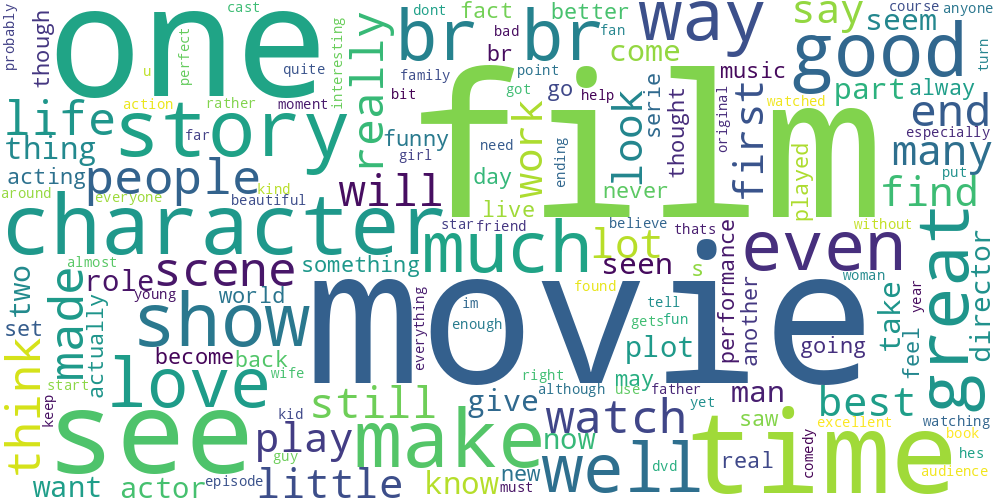
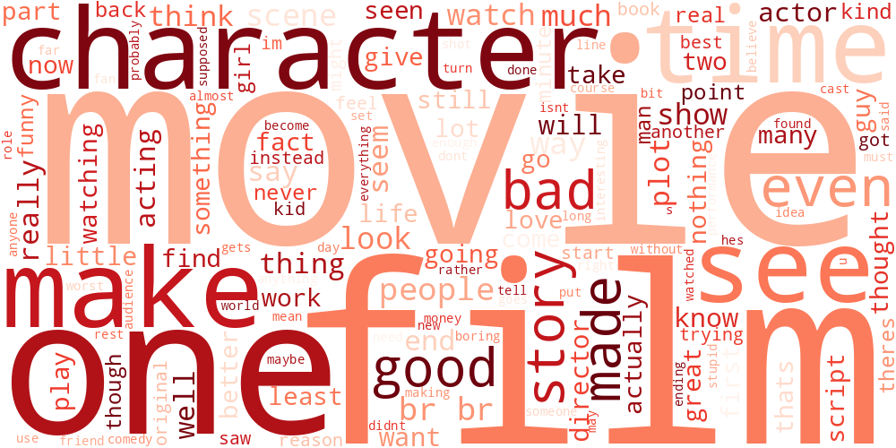

# 🎬 IMDB Sentiment Analysis Engine (Project #17)

## 📌 Project Overview
This project is an automated **Voice of the Customer (VoC)** analytics tool designed to classify large-scale unstructured text data. By leveraging **Natural Language Processing (NLP)** and **Deep Learning**, the engine distinguishes between positive and negative sentiments in movie reviews with high precision.

In a commercial context, this represents a scalable solution for brands to monitor public opinion and product reception without manual intervention.

## 🚀 Performance Metrics
- **Test Accuracy:** 87.12%
- **Core Model:** Sequential Deep Learning Neural Network
- **Vectorization:** N-Gram (Bigram) Count Vectorization
- **Dataset:** 50,000 highly polar IMDB reviews

## 📊 Visual Insights
Our exploratory data analysis reveals distinct linguistic markers. The word clouds below visualize the "vibe" of the dataset based on sentiment frequency:

| Positive Review Insights | Negative Review Insights |
| :---: | :---: |
|  |  |

## 🛠️ Environment & Technical Specifications
This project is optimized for **Python 3.10** to ensure maximum stability with TensorFlow and Scikit-Learn.

### Local Installation (VS Code)
1. **Clone the Project:**
   ```bash
   git clone <your-repository-link>
   cd imdb-sentiment-analysis